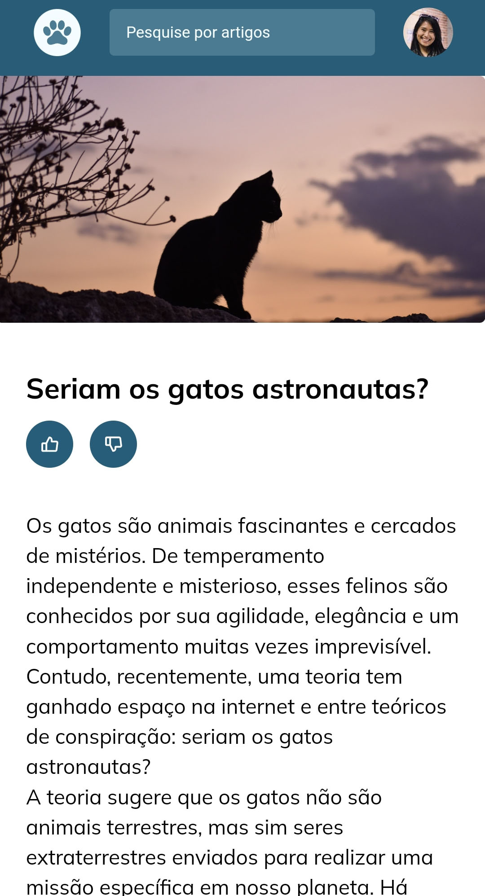
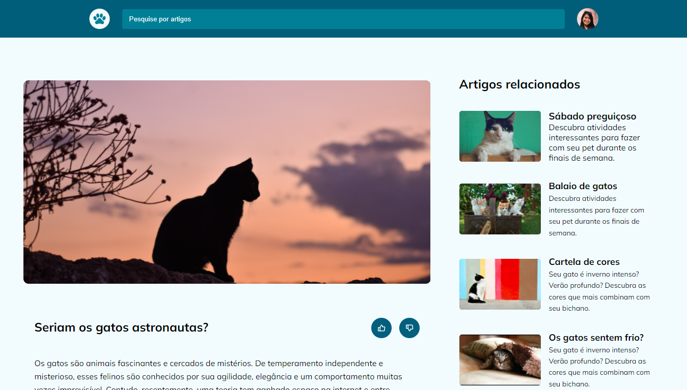

# Desafio - Blog de gatos

🖼️ Layouts do projeto 

# Layout mobile 📱

# layout desktop 🖥️

# Conceitos Utilizados no Projeto

- Mobile First: inicie o projeto deixando-o responsivo em telas menores para depois ajustar para uma versão desktop;
- Unidade de medida flexível;
- Grid;
- Variáveis no CSS;
- Cores HSL;
- Animações e transições simples.

# 🚀 Tecnoogias Utilizadas

- HTML
- CSS
- GitHub

# 📝 Licença

Esse projeto possui licença MIT.

#Projeto Online
Você pode visualizar o projeto online através
<a style="border: none;" href="" target="_blank">desse link</a>.
